# Welcome to Distributed Face-recognition with Go

Name: Gergely Brautigam  
Github: https://github.com/Skarlso/kube-cluster-sample  
Twitter: https://twitter.com/Skarlso  

  

---

# Agenda

- <uil-calender /> **Gauge the Audience** - who knows what how much where why
- <uil-user /> **Small Introduction** - theme can be shared and used with npm packages
- <uil-laptop /> **Technologies used** - kubernetes, face-recognition library, Go, nsq, GRPC
- <uil-jackhammer /> **Architecture** - a bit about the architecture, overview
- <uil-ship /> **Kubernetes** - deeper into the rabbit hole with Kubernetes
- <uil-fidget-spinner /> **Distributed Systems** - why is it distributed exactly?
- <uil-hourglass /> **Demo Time** - anything possible on a webpage
- <uil-rocket /> **Refactoring Exercise** - show me some code

 
 

  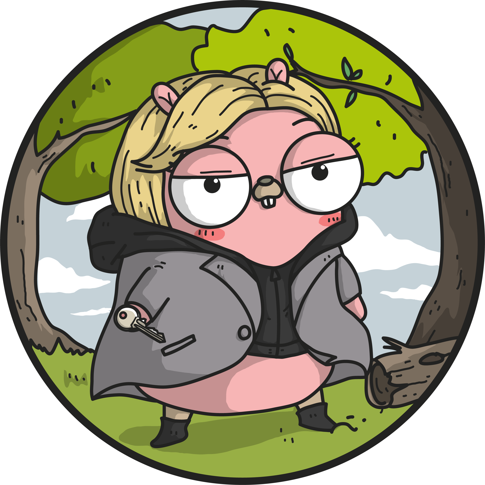

---

# Gauge the Audience
Who has heard off, knows, is familiar, understands

- Kubernetes
- GRPC
- Distributed Systems
- NSQ
- Docker

  

---

# Introduction

- Name: Gergely Brautigam
- Work: Weaveworks
- Twitter: https://twitter.com/Skarlso
- Github: https://github.com/Skarlso
- Website: https://gergelybrautigam.com

  

---

# Technologies

  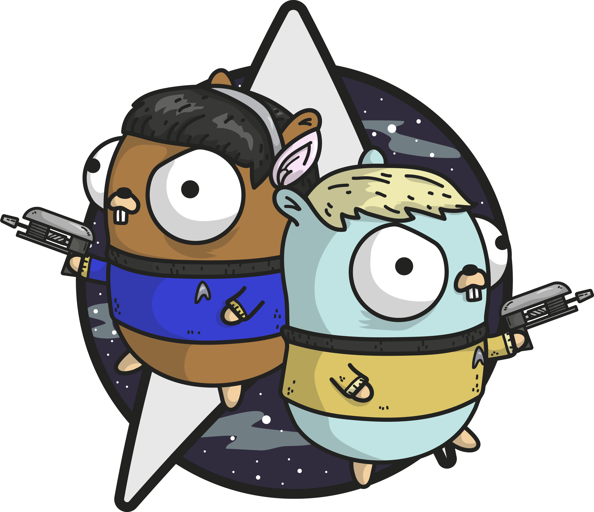

---

## GRPC

<v-clicks>

- Why?
> Because of how we interact with the Python FaceRecognition library.

- Use Case
> Versatile control over the API and strict contracts on how to implement things. 

- buf.build
> GRPC really shines once you implement and use buf.build.

- Benefits
> Strick contract, easy to use, type safety, etc...

- Drawbacks
> Rigid structure, having to provide an SDK, more complex to implement from the client side and parse responses
> without grpc-gateway that provides a JSON based API on top of GRPC.

</v-clicks>

  

---

## Kubernetes

  

---

### Let's try to limit this

- Deployments vs StatefulSets
- Network policies (restrict who can talk to what)
- Service discovery (eeaassyy)
- Secrets and ConfigMaps
- Persistent Volumes and Claims
- Resource Limits
- LoadBalancing, certificate manager and LetsEncrypt (none of that is set up but sounds cool)

  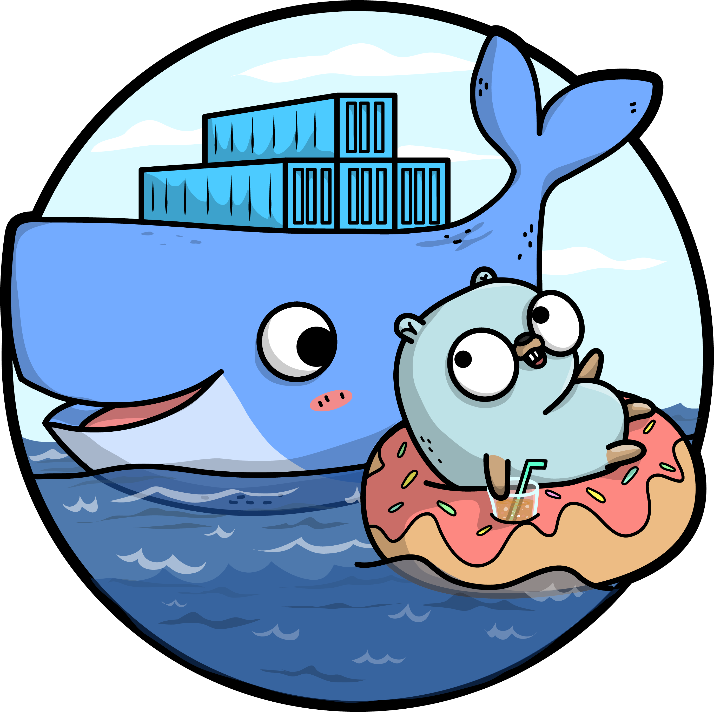

---

## NSQ

> A realtime distributed messaging platform

- Versitile
- Easy to use and set up
- Works out of the box
- There are a number of alternatives since then like KubeMQ but NSQ remains strong
- Distributed setup using nsqd and nsqlookupd

  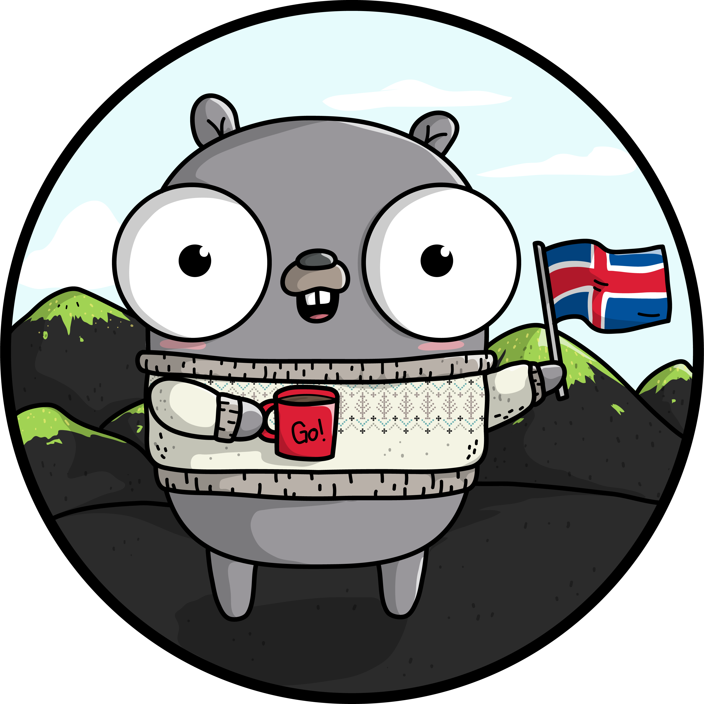

---

## Go

The main question... How is Go helping in all of this?

<v-clicks>

- Fast
- Concurrent
- Easy to write and begin ( started this project almost 4 years ago )
- Lots of nice libraries and wonderful online documentation

</v-clicks>

  

---

## Face recognition

- [face-recognition](https://github.com/ageitgey/face_recognition) library in Python

- Why Python?

<v-click>

> The gocv library wasn't as developed back when I wrote this as it is now.

</v-click>

  

---

# Architecture

  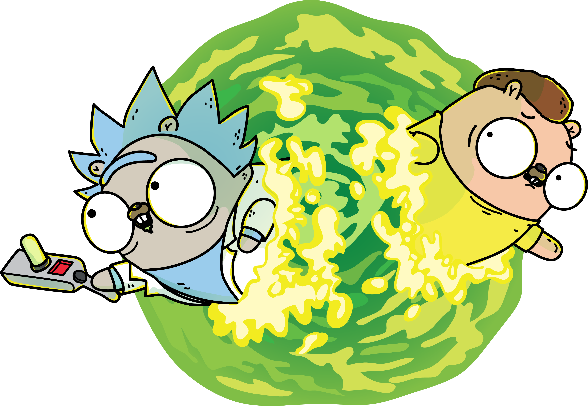

---

## Microservice Architecture

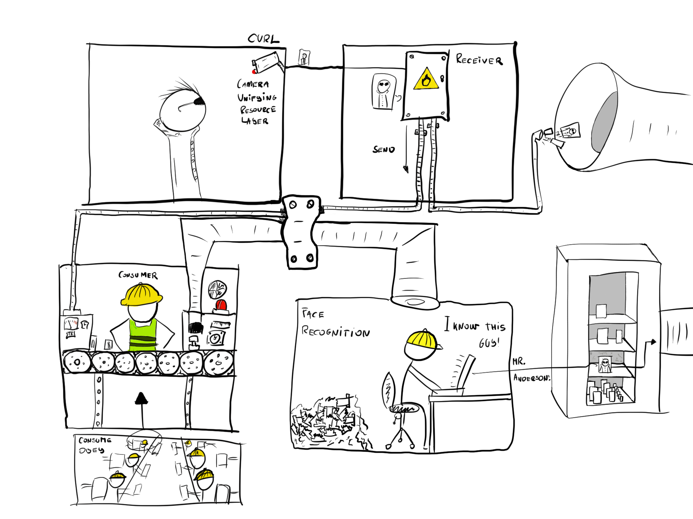

  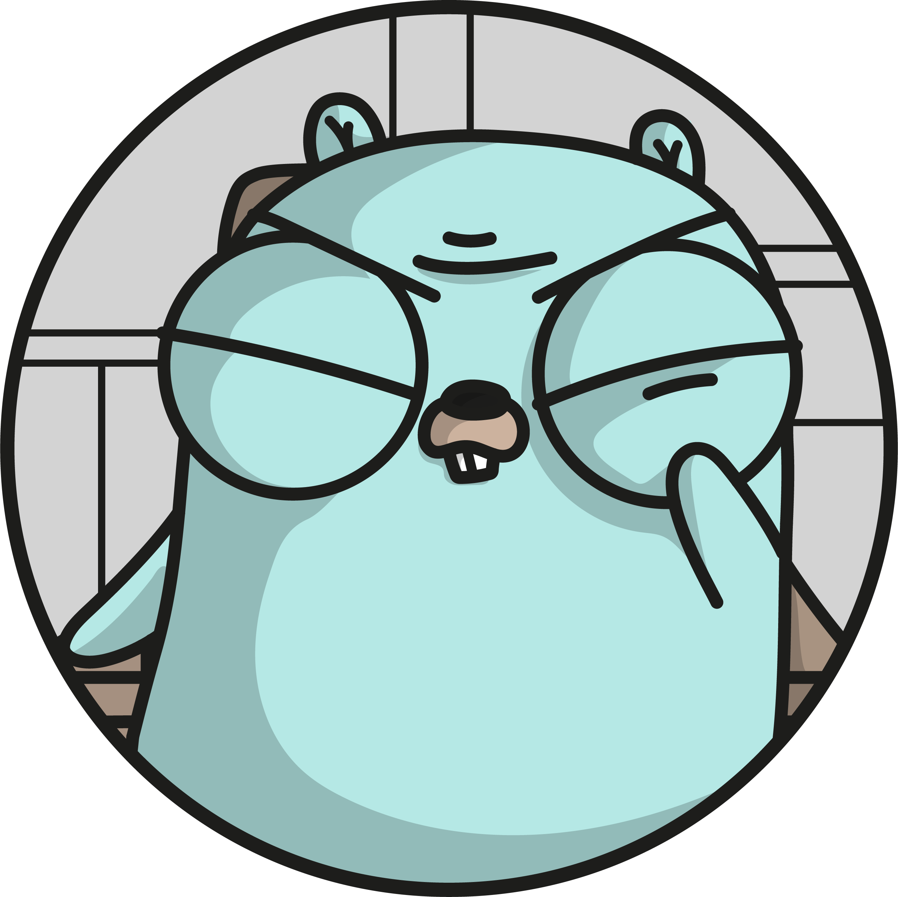

---

## Data flow

Insert a drawing here.

  

---

# Distributed System

  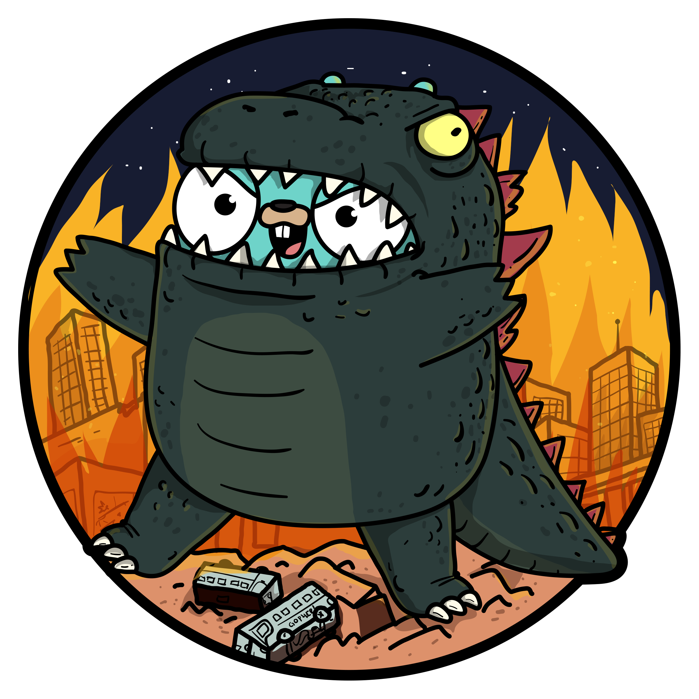

---

Definition of a distributed system:

> Multiple "something" ... linked together through the network to appear as one.

There has to be a sync point.

- How distributed is it?
- Where is the sync point?
- What level of consistency does it provide?
- Where are the pain points and possible resource contests?

  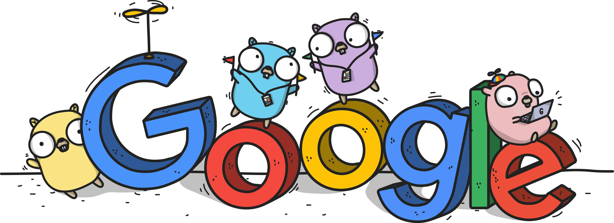

---

# Demo Time

Let's get crackin'!

  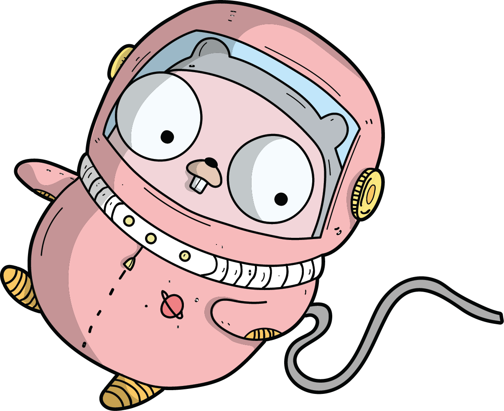

---

# Refactoring

- What
- Why
- Where
- How

  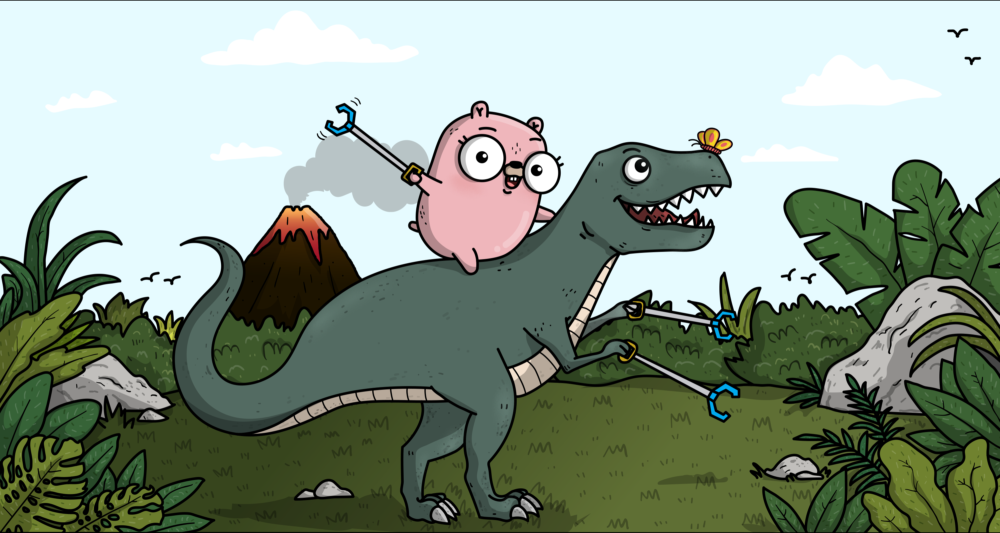

---

# End
Thank you for listening!

  

