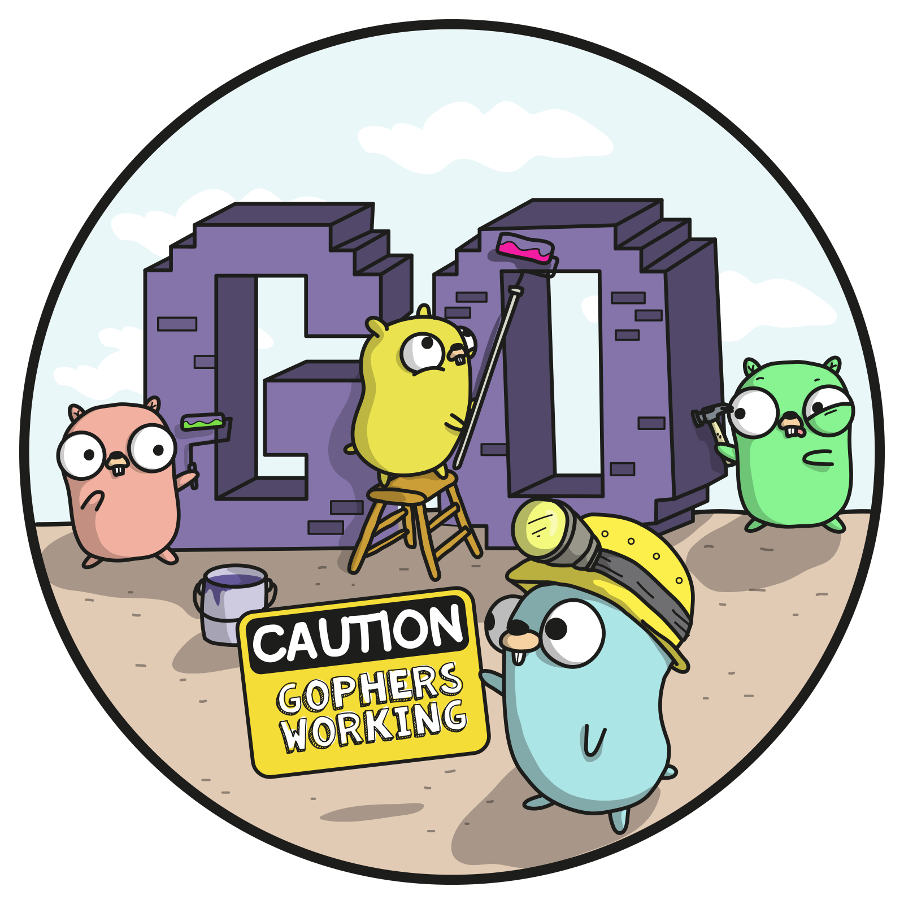

# Welcome to Distributed Face-recognition with Go

Name: Gergely Brautigam  
Github: https://github.com/Skarlso/kube-cluster-sample  
Twitter: https://twitter.com/Skarlso  

---

# Agenda

- <uil-calender /> **Gauge the Audience** - who knows what how much where why
- <uil-user /> **Small Introduction** - theme can be shared and used with npm packages
- <uil-laptop /> **Technologies used** - kubernetes, face-recognition library, Go, nsq, GRPC
- <uil-jackhammer /> **Architecture** - a bit about the architecture, overview
- <uil-ship /> **Kubernetes** - deeper into the rabbit hole with Kubernetes
- <uil-fidget-spinner /> **Distributed Systems** - why is it distributed exactly?
- <uil-screw /> **GRPC** - where does it come in?
- <uil-hourglass /> **Demo Time** - anything possible on a webpage
- <uil-rocket /> **Refactoring Exercise** - shuddup show me some code

 
 

---

# Gauge the Audience
Who has heard off, knows, is familiar, understands

- Kubernetes
- GRPC
- Distributed Systems
- NSQ
- Docker

